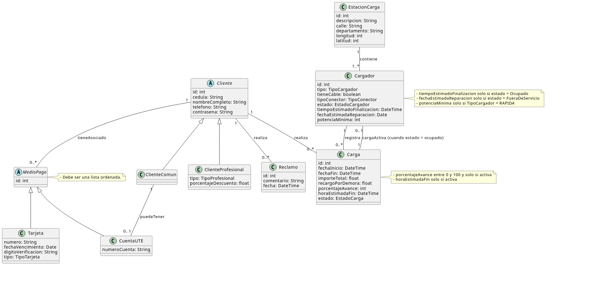

# Sistema Gestor de Movilidad Eléctrica

## Documentación

La documentación completa del proyecto se encuentra disponible en el siguiente enlace:

**https://docs.google.com/document/d/161p8cS9-t2VXaN1o6shKcGh_Wzolf8ezpmyTF_6onWg/edit?usp=drive_link**

---

## Diagrama de Dominio



---

## Pruebas de la API

A continuación se presentan ejemplos de solicitudes `curl` para probar los distintos endpoints expuestos por la aplicación.

### Clientes

#### Registrar Cliente Común

```bash
curl -X POST http://localhost:8080/movilidad-electrica/api/cliente/registrar \
  -H "Content-Type: application/json" \
  -d '{
    "cedula":"12345678",
    "nombreCompleto":"Juan Perez",
    "telefono":"099123456",
    "contra":"pass123",
    "esProfesional":false
  }'
```

#### Registrar Cliente Profesional (TAXI)

```bash
curl -X POST http://localhost:8080/movilidad-electrica/api/cliente/registrar \
  -H "Content-Type: application/json" \
  -d '{
    "cedula":"87654321",
    "nombreCompleto":"Maria Rodriguez",
    "telefono":"098765432",
    "contra":"taxi123",
    "esProfesional":true,
    "tipoProfesion":"TAXI",
    "porcentajeDescuento":15.0
  }'
```

#### Registrar Cliente Profesional (UBER)

```bash
curl -X POST http://localhost:8080/movilidad-electrica/api/cliente/registrar \
  -H "Content-Type: application/json" \
  -d '{
    "cedula":"11222333",
    "nombreCompleto":"Carlos Gomez",
    "telefono":"091234567",
    "contra":"uber123",
    "esProfesional":true,
    "tipoProfesion":"UBER",
    "porcentajeDescuento":10.0
  }'
```

#### Registrar Cliente Profesional (CABIFY)

```bash
curl -X POST http://localhost:8080/movilidad-electrica/api/cliente/registrar \
  -H "Content-Type: application/json" \
  -d '{
    "cedula":"44555666",
    "nombreCompleto":"Ana Martinez",
    "telefono":"092345678",
    "contra":"cabify123",
    "esProfesional":true,
    "tipoProfesion":"CABIFY",
    "porcentajeDescuento":12.5
  }'
```

#### Obtener Todos los Clientes

```bash
curl http://localhost:8080/movilidad-electrica/api/cliente/todos
```

---

### Reclamos

#### Registrar Reclamo

```bash
curl -X POST http://localhost:8080/movilidad-electrica/api/cliente/registrarReclamo \
  -H "Content-Type: application/json" \
  -d '{
    "comentario":"El cargador dejó de funcionar al segundo día",
    "idCliente":1
  }'
```

---

### Medios de Pago

#### Alta de Medio de Pago - TARJETA

```bash
curl -X POST http://localhost:8080/movilidad-electrica/api/cliente/altaMedioPago \
  -H "Content-Type: application/json" \
  -d '{
    "idCliente":1,
    "tipo":"TARJETA"
  }'
```

#### Alta de Medio de Pago - FACTURA_UTE

```bash
curl -X POST http://localhost:8080/movilidad-electrica/api/cliente/altaMedioPago \
  -H "Content-Type: application/json" \
  -d '{
    "idCliente":1,
    "tipo":"CUENTA_UTE"
  }'
```

---
